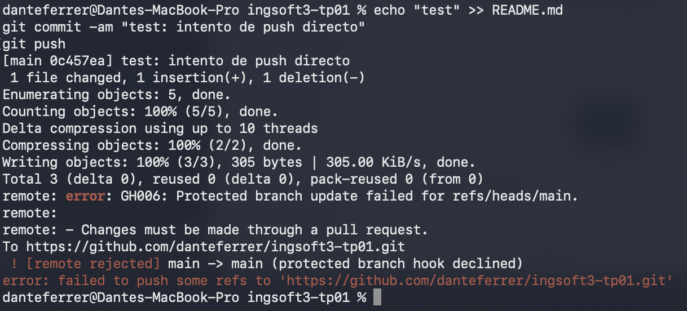
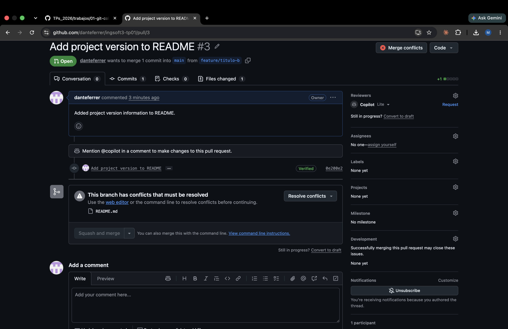
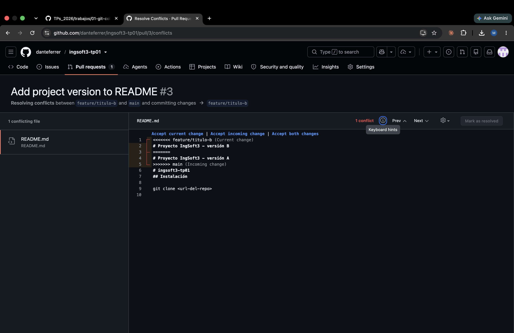
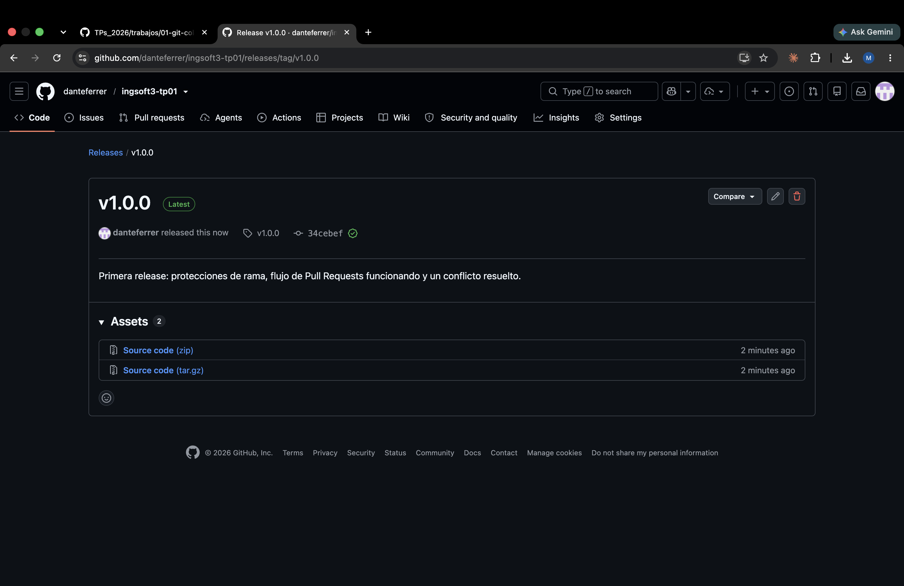

# Evidencias — TP1

## 1. Push directo a main rechazado

GitHub rechaza el push porque main está protegida y la regla alcanza también al dueño del repo.

## 2. Aviso de conflicto en el PR

El PR de la rama B no se puede mergear automáticamente porque toca la misma línea que ya mergeó la rama A.

## 3. Marcadores del conflicto

El editor de conflictos de GitHub mostrando los marcadores de conflicto en README.md.

## 4. Release v1.0.0 publicada

La release v1.0.0 publicada sobre el tag correspondiente.
