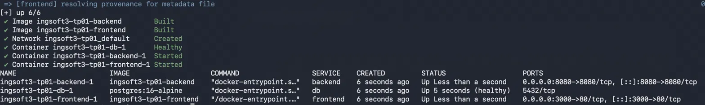
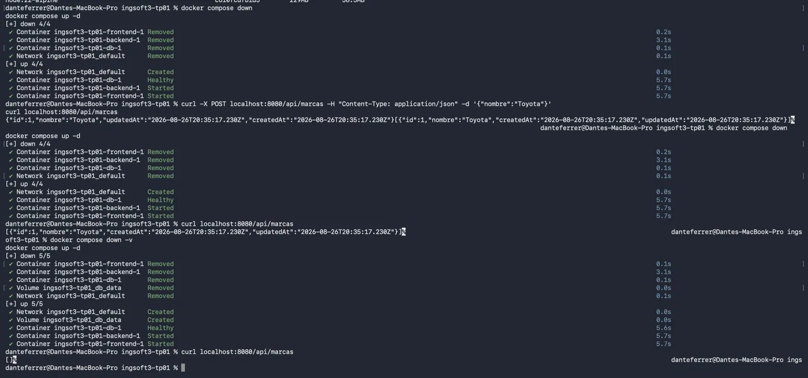
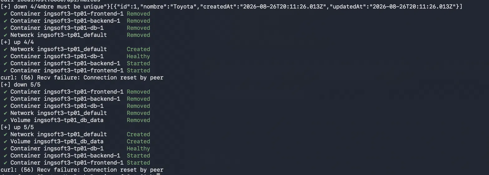
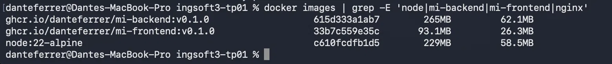

# Evidencias — TP1

## 1. Push directo a main rechazado

GitHub rechaza el push porque main está protegida y la regla alcanza también al dueño del repo.

## 2. Aviso de conflicto en el PR

El PR de la rama B no se puede mergear automáticamente porque toca la misma línea que ya mergeó la rama A.

## 3. Marcadores del conflicto

El editor de conflictos de GitHub mostrando los marcadores de conflicto en README.md.

## 4. Release v1.0.0 publicada

La release v1.0.0 publicada sobre el tag correspondiente.

# Evidencias — TP2 (Contenedores)

## 1. `docker compose up -d --build` desde cero, sistema funcionando end-to-end


`docker compose up -d --build` construyendo ambas imágenes, levantando `db`
(healthy), `backend` y `frontend`, y `docker compose ps` mostrando los tres
servicios arriba.

## 2. Prueba de persistencia (`down` vs. `down -v`)


Cargo una marca (`Toyota`) → `down` (sin `-v`) → `up` → sigue estando → `down -v`
→ `up` → desapareció. El estado real vive solo en el volumen `db_data`.


Acá me crucé con el problema de timing de `decisiones.md`: un `curl` justo
después del `up` dio `Connection reset by peer` aunque los contenedores ya
figuraban `Healthy`. Reintentando unos segundos después, andaba bien.

## 3. Comparación de tamaño: imagen SDK vs. imagen final


`docker images` filtrado a las imágenes relevantes: `mi-backend:v0.1.0`
(265MB), `mi-frontend:v0.1.0` (93.1MB) y `node:22-alpine` (229MB), la imagen
SDK usada en la etapa `build` de ambos Dockerfiles.

- **Frontend**: la imagen final (93.1MB) es casi igual a `nginx:alpine` solo
  (93.6MB) — el SDK de Node (229MB) nunca llega, solo los estáticos de `dist/`.
- **Backend**: la imagen final (265MB) es más grande que `node:22-alpine` solo
  (229MB), porque necesita `node_modules` de producción para correr. Acá la
  ganancia no es de tamaño sino de contenido: `npm prune --omit=dev` saca las
  devDependencies (`nodemon`) de la imagen final.

## 4. Imágenes publicadas en el registry, verificadas públicas

```
$ docker logout ghcr.io
Removing login credentials for ghcr.io

$ docker rmi ghcr.io/danteferrer/mi-backend:v0.1.0
$ docker pull ghcr.io/danteferrer/mi-backend:v0.1.0
v0.1.0: Pulling from danteferrer/mi-backend
Status: Downloaded newer image for ghcr.io/danteferrer/mi-backend:v0.1.0

$ docker rmi ghcr.io/danteferrer/mi-frontend:v0.1.0
$ docker pull ghcr.io/danteferrer/mi-frontend:v0.1.0
v0.1.0: Pulling from danteferrer/mi-frontend
Status: Downloaded newer image for ghcr.io/danteferrer/mi-frontend:v0.1.0
```

Ambas imágenes se descargaron sin estar logueado en `ghcr.io`, confirmando que
los packages `mi-backend` y `mi-frontend` son públicos.
